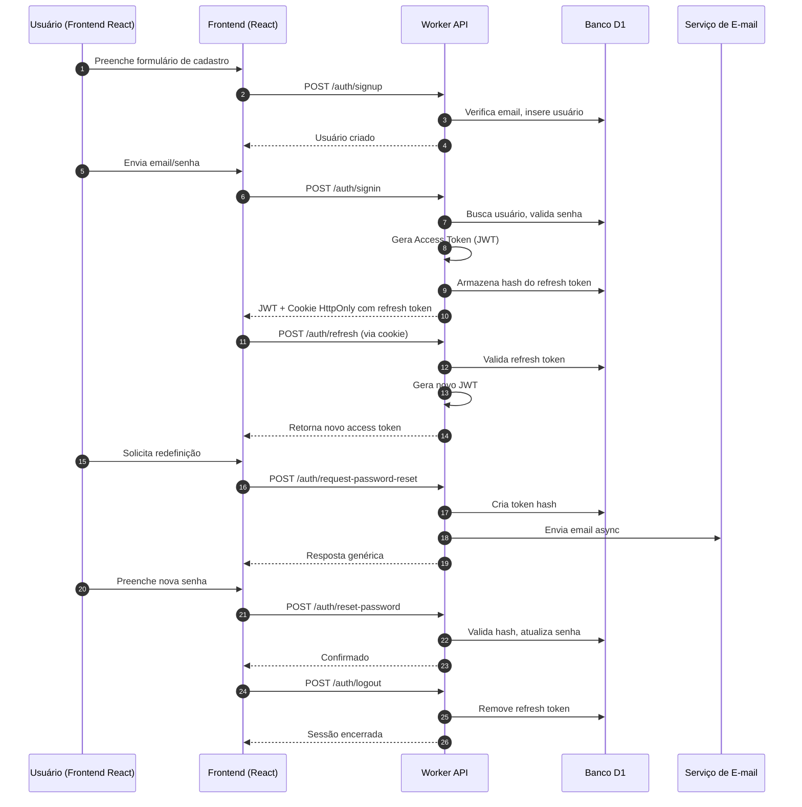

# 📘 Arquitetura de Autenticação – Versão 2.0 (Revisada e Ampliada)

Esta documentação descreve a arquitetura completa de autenticação da aplicação, que utiliza:

*   Frontend em React
*   Backend serverless em Cloudflare Workers
*   Banco de dados Cloudflare D1
*   Tokens JWT + Refresh Token persistido

O objetivo é garantir segurança, baixa latência, compatibilidade, escalabilidade e simplicidade operacional.

## 🎯 Visão Geral da Arquitetura

A autenticação segue o padrão moderno Access Token + Refresh Token, onde:

*   O **Access Token (JWT)** tem curta duração (15 minutos).
*   O **Refresh Token** tem longa duração (30 dias), é armazenado no banco somente em forma de hash SHA-256, e enviado ao cliente via cookie `HttpOnly` + `Secure` + `SameSite=Strict`.

## 🧩 Diagrama Geral da Arquitetura

Aqui está o diagrama visual usando Mermaid, podendo ser renderizado no GitHub, Notion, GitLab ou VSCode:



## 🏗️ Componentes da Arquitetura

### 1. Frontend (React)

Responsável por:
*   Fluxos de UI de login, signup, reset password.
*   Armazenar apenas o **Access Token**.
*   Usar `axios` + interceptors para:
    *   Gerenciar expiração.
    *   Renovar tokens automaticamente.
    *   Evitar "refresh storm" (lock + fila).
*   Não armazena Refresh Token (apenas cookie `HttpOnly`).

### 2. Backend: Cloudflare Worker (`worker-auth.js`)

Responsável por:
*   Criptografar dados sensíveis.
*   Consultar e atualizar o banco D1.
*   Gerar tokens JWT.
*   Gerar refresh tokens e armazenar hashes.
*   Validar tokens.
*   Enviar e-mails via providers externos.
*   Garantir segurança e proteção contra ataques.

### 3. Banco de Dados: Cloudflare D1

Tabelas recomendadas:

| Tabela: `users` | | |
| :--- | :--- | :--- |
| **coluna** | **tipo** | **descrição** |
| `id` | `TEXT (UUID)` | PK |
| `email` | `TEXT` | único, lowercase |
| `password_hash` | `TEXT` | hash bcrypt |
| `created_at` | `TEXT` | timestamp |

| Tabela: `refresh_tokens` | | |
| :--- | :--- | :--- |
| **coluna** | **tipo** | **descrição** |
| `id` | `TEXT (UUID)` | PK |
| `user_id` | `TEXT` | FK `users` |
| `token_hash` | `TEXT` | hash SHA-256 do refresh token |
| `created_at` | `TEXT` | timestamp |
| `expires_at` | `TEXT` | 30 dias |
| `user_agent` | `TEXT` | opcional |
| `ip` | `TEXT` | opcional |

| Tabela: `password_reset_tokens` | | |
| :--- | :--- | :--- |
| **coluna** | **tipo** | **descrição** |
| `token_hash` | `TEXT` | hash SHA-256 |
| `user_id` | `TEXT` | FK `users` |
| `expires_at` | `TEXT` | 30 min |

> Todas as tabelas devem ter índices nos campos usados em busca.

## 🔐 Fluxo Completo de Autenticação

### 1. Cadastro (`POST /auth/signup`)
*   **Processo:**
    1.  Normalizar e-mail (`trim`, `lowercase`).
    2.  Verificar duplicidade (`409`).
    3.  Gerar `bcrypt.hash`.
    4.  Criar usuário no D1.

### 2. Login (`POST /auth/signin`)
*   **Processo:**
    1.  Normalizar e-mail.
    2.  Buscar usuário.
    3.  Validar senha com `bcrypt.compare`.
    4.  Gerar:
        *   `accessToken` (JWT).
        *   `refreshToken` (string aleatória).
    5.  Salvar hash SHA-256 do `refreshToken` no D1.
    6.  Enviar cookie `HttpOnly; Secure; SameSite=Strict`.

#### 🎫 Formato do Access Token (JWT Claims)
```json
{
  "sub": "USER_ID",
  "email": "email@example.com",
  "iat": 123456789,
  "exp": 123456789
}
```

### 3. Refresh de Token (`POST /auth/refresh`)
O frontend dispara automaticamente usando `axios` interceptor.
*   **Processo:**
    1.  Ler `refreshToken` do cookie.
    2.  Hash SHA-256.
    3.  Verificar hash no D1.
    4.  Gerar novo `accessToken`.
    5.  Atualizar `expires_at` (opcional).

#### 🔁 Rotação opcional de refresh token (melhor segurança)
Pode ser ativada:
*   Novo `refreshToken` é emitido a cada refresh.
*   O antigo é invalidado.
*   Proteção contra "refresh token reuse detection".

### 4. Recuperação de Senha
#### Etapa A – Solicitar Reset (`POST /auth/request-password-reset`)
*   **Processo:**
    1.  Normalizar email.
    2.  Se existir: gerar token seguro.
    3.  Armazenar SHA-256 hash + expiração 30min.
    4.  Enviar link via email (assíncrono com `ctx.waitUntil`).
    5.  Responder mensagem genérica independente do resultado.

#### Etapa B – Redefinir Senha (`POST /auth/reset-password`)
*   **Processo:**
    1.  Hash SHA-256 do token recebido.
    2.  Validar no banco.
    3.  Criar novo hash `bcrypt`.
    4.  Atualizar usuário.
    5.  Remover token da tabela.

### 5. Logout (`POST /auth/logout`)
*   **Responsável por:**
    1.  Remover `refreshToken` do banco.
    2.  Invalidar a sessão atual.
    3.  Opcional: remover todas as sessões do usuário.

## ⚙️ Padrão de Respostas da API
Todas as rotas de sucesso retornam JSON:
```json
{
  "success": true,
  "message": "Descrição...",
  "data": { }
}
```

Erros:
```json
{
  "error": "INVALID_CREDENTIALS",
  "message": "Email ou senha incorretos"
}
```

## 🛡️ Segurança – Checklist
- [x] Hash de tokens sensíveis (SHA-256).
- [x] Senhas com `bcrypt` (custo 10–12).
- [x] Refresh token em cookie `HttpOnly` + `Secure` + `Strict`.
- [x] Anti-enumeração de contas.
- [ ] Rate limiting em:
    *   login
    *   refresh
    *   reset password
- [x] CORS restrito ao domínio do frontend.
- [ ] Limpeza automática de tokens expirados.
- [ ] Registros de auditoria (opcional).
- [x] Não expor `stack trace` ao cliente.

## 🧪 Testes Recomendados
*   Login com senha incorreta.
*   Refresh expirado.
*   Refresh token inválido.
*   Fluxo completo de reset password.
*   Reutilização de token inválida.
*   Logout cancela a sessão.
*   **Ataques comuns:**
    *   brute force
    *   replay
    *   CSRF (protegido por `SameSite`)

## 🏁 Conclusão
Esta nova versão da documentação:
✓ Está mais clara.
✓ Tem diagrama visual.
✓ Tem detalhes técnicos que antes faltavam.
✓ Segue padrões profissionais modernos.
✓ Pode ser usada como referência para todo o time.
✓ Previne ambiguidades durante o desenvolvimento.
