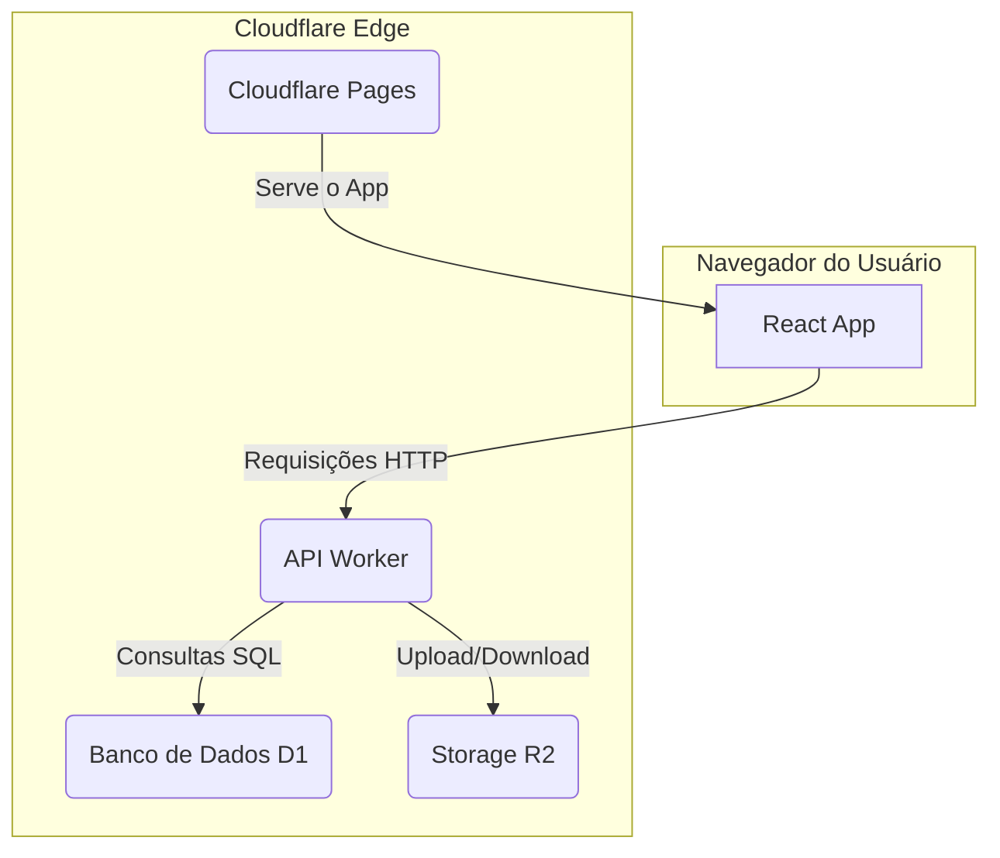

# 🚀 Governance System


O Governance System é uma plataforma de gestão de governança, usando a moderna stack de Jamstack para fornecer uma experiência de usuário rápida, segura e escalável.

---

## 🏗️ Arquitetura

O sistema é construído sobre a plataforma de edge da Cloudflare, combinando um front-end dinâmico em React com um back-end serverless robusto.

- **Front-end**: Uma Single-Page Application (SPA) em **React** e **TypeScript**, utilizando **Material-UI** para uma interface rica e responsiva.
- **Back-end (API)**: Um **Cloudflare Worker** que expõe uma API, escrito em TypeScript.
- **Banco de Dados**: **Cloudflare D1**, um banco de dados serverless baseado em SQLite.
- **Armazenamento de Ativos**: **Cloudflare R2** para armazenamento de imagens e outros ativos estáticos.

### Diagrama de Fluxo



---

## ⚙️ Guia de Setup e Execução

Siga os passos abaixo para configurar e executar o projeto em um ambiente de desenvolvimento.

### 1. Pré-requisitos

- **Node.js**: Versão LTS (v18 ou superior).
- **npm**: Versão 8 ou superior.
- **Conta na Cloudflare**: Com acesso aos serviços **Workers**, **D1** e **R2**.
- **Wrangler CLI**: `npm install -g wrangler`

### 2. Instalação

Clone o repositório e instale as dependências do front-end e dos back-ends.

```bash
# 1. Instale as dependências do front-end (React)
npm install

# 2. Navegue para o diretório do worker da API e instale suas dependências
cd d1-api-worker
npm install
cd ..

# 3. Instale as dependências do serviço de migração de assets
cd server
npm install
cd ..
```

### 3. Configuração do Ambiente
As credenciais são necessárias tanto para a API (Worker) quanto para o script de migração (Node.js).

#### 3.1. Configuração da API (Worker)

1.  **Navegue até a pasta do worker**: `cd d1-api-worker`
2.  **Crie o arquivo de segredos**: `touch .dev.vars`
3.  **Adicione as credenciais**:

    ```ini
    # Arquivo: d1-api-worker/.dev.vars
    R2_ACCESS_KEY_ID="SEU_ACCESS_KEY_ID"
    R2_SECRET_ACCESS_KEY="SUA_SECRET_ACCESS_KEY"
    R2_BUCKET_NAME="governance-system-assets"
    CLOUDFLARE_ACCOUNT_ID="SEU_ACCOUNT_ID"
    ```

#### 3.2. Configuração do Script de Migração

1.  **Navegue até a pasta do servidor**: `cd server`
2.  **Crie o arquivo de variáveis**: `touch .env`
3.  **Adicione as mesmas credenciais do R2**:

    ```ini
    # Arquivo: server/.env
    R2_ACCESS_KEY_ID=SEU_ACCESS_KEY_ID
    R2_SECRET_ACCESS_KEY=SUA_SECRET_ACCESS_KEY
    R2_BUCKET_NAME=governance-system-assets
    R2_ENDPOINT=https://<ACCOUNT_ID>.r2.cloudflarestorage.com
    ```

### 4. Migração de Ativos (Primeira Execução)

Antes de iniciar a aplicação pela primeira vez, você precisa enviar as imagens locais para o seu bucket no Cloudflare R2. O projeto inclui um script para automatizar isso.

```bash
# Execute o comando de migração a partir da pasta 'server'
cd server && npm run migrate
```
Este comando lerá as imagens da pasta de ativos e fará o upload para o bucket R2. **Este passo só precisa ser executado uma vez.**

### 5. Gestão do Banco de Dados (Migrations)

O schema do banco de dados D1 é gerenciado através de migrações.

```bash
# A partir da pasta `d1-api-worker`

# 1. Crie um novo arquivo de migração (ex: adicionar_tabela_usuarios)
npx wrangler d1 migrations create governance-system-db adicionar_tabela_usuarios

# 2. Aplique as migrações no banco de dados local para desenvolvimento
npx wrangler d1 migrations apply governance-system-db --local

# 3. Aplique as migrações no banco de dados de produção
npx wrangler d1 migrations apply governance-system-db --remote
```

### 6. Executando a Aplicação Localmente

Para rodar a aplicação, você precisa iniciar o front-end e o back-end separadamente.

```bash
# Em um terminal, inicie o back-end (API Worker) a partir da pasta d1-api-worker
cd d1-api-worker
npm run dev

# Em outro terminal, inicie o front-end (React) a partir da raiz do projeto
npm start
```

- O front-end estará disponível em `http://localhost:3000`.
- O back-end (worker) estará disponível em `http://localhost:8787`.

---

## 🧪 Executando Testes

Para garantir a qualidade e a estabilidade do código, execute a suíte de testes.

```bash
# (TODO: Adicionar comando de teste, ex: npm test)
```

---

## 🚀 Deploy (Publicação)

O deploy é feito em duas etapas: o back-end (Worker) e o front-end (Pages).

### Back-end (API Worker)

O deploy do worker é feito com o Wrangler a partir da sua pasta.

```bash
# 1. Navegue até a pasta do worker
cd d1-api-worker

# 2. Execute o comando de deploy
npm run deploy
```

### Front-end (Cloudflare Pages)

O deploy do front-end é feito via `git push`. A Cloudflare Pages está configurada para:
1.  Observar o branch `main`.
2.  Executar o comando de build: `npm run build`.
3.  Publicar o diretório de saída: `build`.

---

## 📚 Referência da API (Endpoints)

A seguir, um exemplo de como documentar os endpoints da API.

### Exemplo: Listar Usuários
Retorna uma lista paginada de usuários ativos.

- **URL:** `/api/users`
- **Método:** `GET`
- **Auth:** Necessário (Bearer Token)

**Resposta de Sucesso (200 OK):**
```json
{
  "data": [
    { "id": 1, "name": "Admin", "role": "admin" },
    { "id": 2, "name": "Gestor", "role": "manager" }
  ],
  "page": 1,
  "total": 45
}
```

*(TODO: Listar e documentar todos os outros endpoints da API)*

---

## 📂 Estrutura do Projeto

```
.
├── d1-api-worker/    # Projeto do Cloudflare Worker (Back-end)
│   ├── src/index.ts  # Ponto de entrada da API
│   ├── wrangler.toml # Configuração do Worker e bindings D1/R2
│   └── package.json
│
├── public/           # Ativos públicos do front-end
│
├── src/              # Código-fonte do React (Front-end)
│   ├── assets/       # Temas, fontes e imagens
│   ├── components/   # Componentes reutilizáveis
│   ├── layouts/      # Estruturas de página (dashboards, auth)
│   ├── routes.tsx    # Definição das rotas da aplicação
│   └── App.tsx       # Componente principal
│
├── server/           # Scripts de suporte (ex: migração de assets)
│
├── package.json      # Dependências do front-end
└── README.md         # Esta documentação
```

---

## 🔧 Resolução de Problemas Comuns

- **Erro `No D1 database found`**: Certifique-se de que o arquivo `wrangler.toml` tem o `database_id` correto e que você rodou `npx wrangler d1 migrations apply --local`.

- **Erro de CORS**: Se o front-end não conseguir se comunicar com a API local, verifique se o Worker está retornando os headers `Access-Control-Allow-Origin` corretamente em suas respostas.

- **Imagens não carregam**: Verifique se o bucket R2 está configurado como público ou se as credenciais no arquivo `.dev.vars` (para o worker) e `.env` (para o script de migração) estão corretas.
